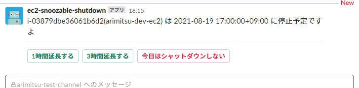

# 有光式スヌーズ機能付き EC2 インスタンス停止 Lambda

## これは何をするものか



AWSの自動停止ソリューションは数あるもののどれも機能が貧弱なのと、
よく発生する「止め忘れは困るけど今日は学習するから回しておきたい・・・」というニーズに応えられるものが無かった為、Azure VM の自動シャットダウンをパクって車輪を再発明したものです。

## インストール方法

1. 新規Lambdaを作成し、lambda_function.pyをコピペする
   
   * タイムアウト3秒はキツイので伸ばす
   * Lambdaの実行ロールに EC2 の操作ポリシーアタッチしておくのを忘れない
 
2. API Gateway を作る
   
   * API Gateway に POST メソッドを作り、作った Lambda を呼び出す設定を行う
  
3. Slack アプリを作ってインストール
   
   * Interactve Components を有効化し、Interactivity & Shortcuts のリクエストURLに API Gateway のメソッドのURLを入れる
   * Botを有効化し、トークンを取っておく
   * Permssionから chat:write スコープを有効化し、ワークスペースにインストールする
   * アプリを通知チャンネルに追加する
  
4. 諸々の情報をソース先頭の情報にコピペする
   
   * AWSリージョン
   * SlackのBOTトークン
   * SlackのチャンネルID

5. Cloud Watch Event で適当に起動間隔を設定する

6. 操作対象EC2のタグ ec2-snoozable-shutdown に停止時刻と何分前にリマインドするか入れておく

    ```
    {"defaultShutdown": "1930", "remind": "30", "autoSnoozeCpuThreshold(\*2)": "80"}
    ```

(*) verbose_notification = True だと起動・停止検出時にもSlackにメッセージを送信します。邪魔なら外してください。
(\*2) autoSnoozeCpuThreshold オプションが指定されている場合、CPU利用率が設定値を越えていると自動でシャットダウンを延長します。

## 開発仕様メモ

### タグ

　余計なDBは作りたくないのでEC2のタグに状態を入れて気合で管理する。

```json
{
    "defaultShutdown": "1900",                     // 停止時刻
    "remind" : "10",                               // リマインドメッセージ送るタイミング(予定時刻 n分前)
    "state" : "running",                           // 前回のstate
    "shutdownSchedule" : "YYYY-MM-DD hh:mm:ss",    // シャットダウン予定時刻
    "sendRemind": "xxxxxx.xx",                     // リマインドメッセージのTS
    "autoSnoozeCpuThreshold": "30"                 // CPU利用率がこの値を越えている場合、自動延長
}
```

### 挙動

一定間隔で起動、ec2-snoozable-shutdown タグが入っているEC2インスタンスに対し定時処理。

* running

  * "shutdownSchedule" なし  
    defaultShutdownからその日(もしくは次の日)の停止時刻を決め、shutdownScheduleに入れる

  * "shutdownSchedule" あり
    * 現在時刻 > shutdownSchedule  
      EC2停止

    * 現在時刻 > shutdownSchedule - remind分 & sendRemind = False  
      リマインド送信  
      sendRemind = True

* stopped

  * "state" = "running"  
    shutdownSchedule削除  
    sendRemind 削除  
    slackに送ったリマインドメッセージ削除  

* アクションメッセージ受信時

  shutdownSchedule更新  
  sendRemind 削除  
  slackに送ったリマインドメッセージ削除  

